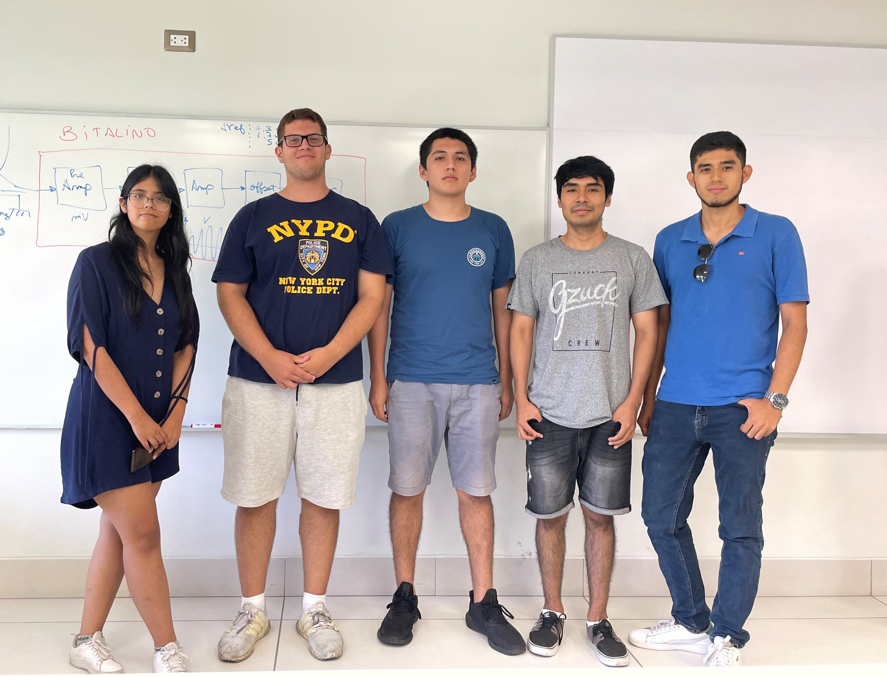
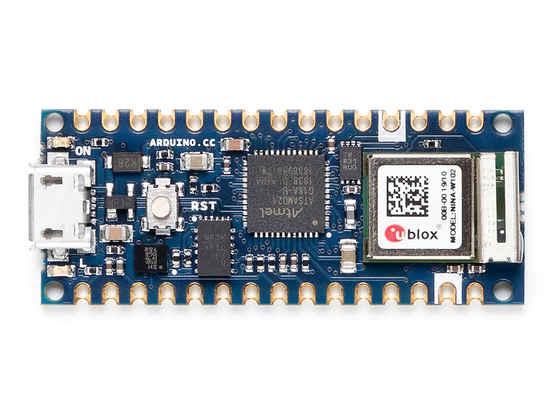
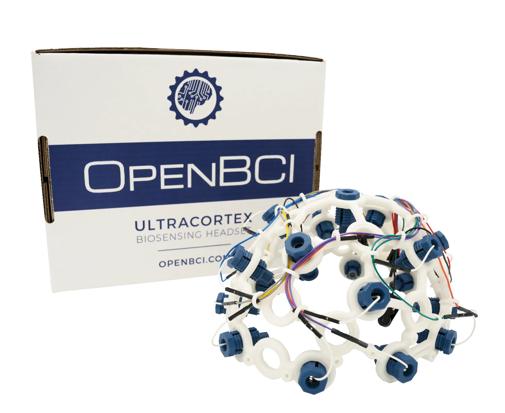
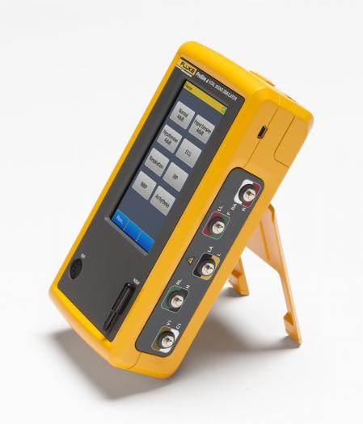
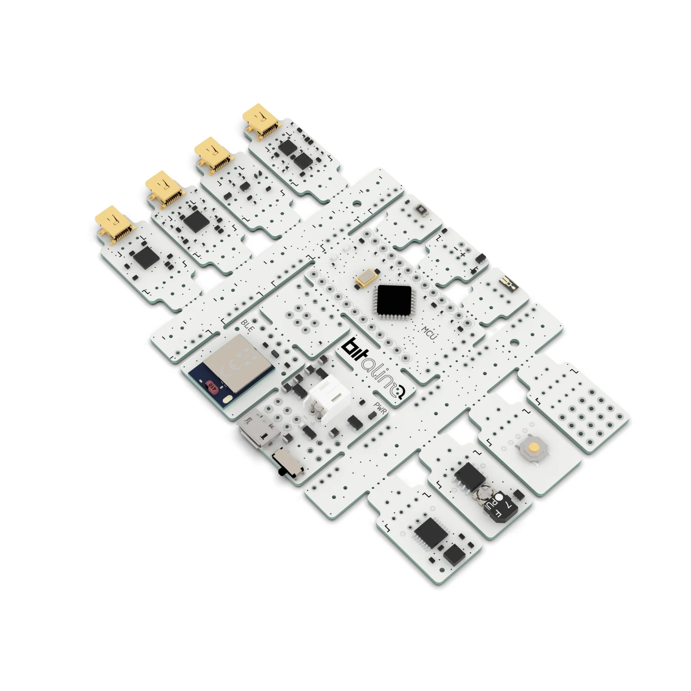

# Grupo 11 - Introduccion a Señales Biomedicas
Bienvenidos al repositorio del grupo 11 del curso "Introduccion a Señales Biomedicas"

## Nombre del Proyecto

Breve descripción del proyecto.

### Tabla de contenidos

- [Integrantes](#Integrantes)
- [Materiales](#Materiales)
- [Documentacion](#Documentacion)

### Integrantes:

El equipo de trabajo está conformado por los siguientes estudiantes:

* Erika Paola Uchuya Trocones (colaborador) - erika.uchuya@upch.pe
* Hector Dair Alegria Cortez (colaborador) - hector.alegria@upch.pe
* Jorge Eduardo Medina Celiz (colaborador) - jorge.medina@upch.pe
* Fernando Eduardo Puipulivia Zarate (colaborador) - fernando.puipulivia@upch.pe

### Materiales

Lista de materiales necesarios para la adquisición de las señales y el procesamiento inicial de tales datos.

1)  Arduino nano 33 IoT
  

  
2) Arduino TinyML kit

  
  
3)  Ultracortex EEG headset
  

4)  Fluke ProSim 4
  

5)  BiTalino
  

### Documentacion

Se resumen en esta sección los avances semanales del proyecto.
  
1. Semana 1:
  
2. Semana 2:

3. Semana 3:
