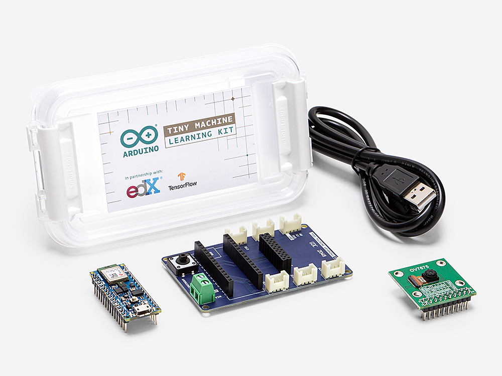
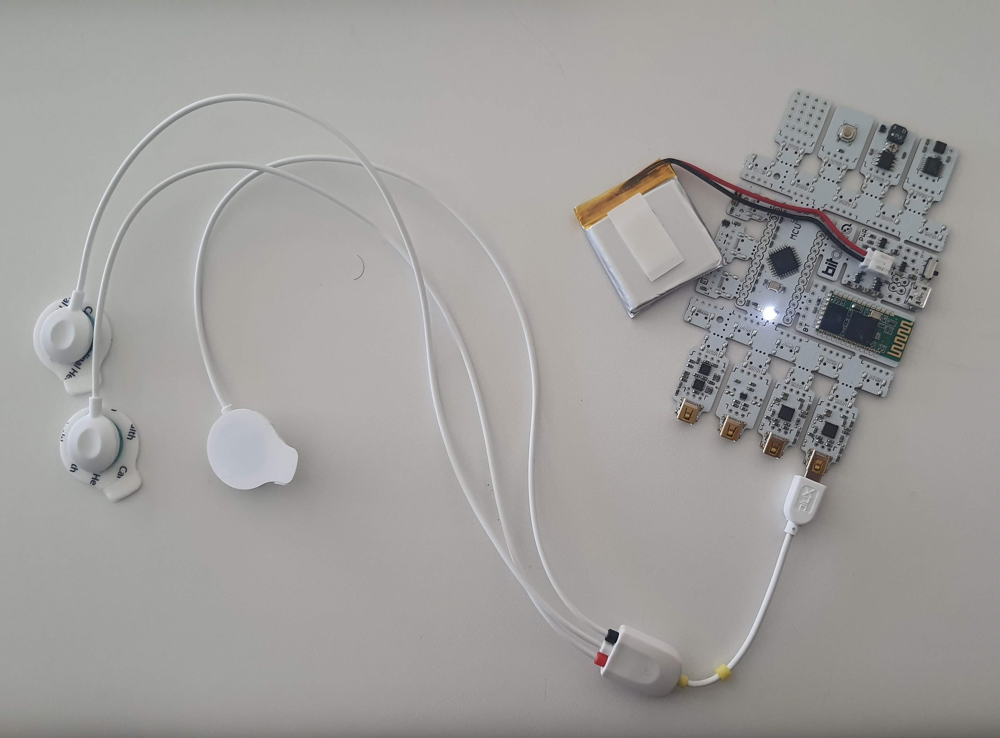
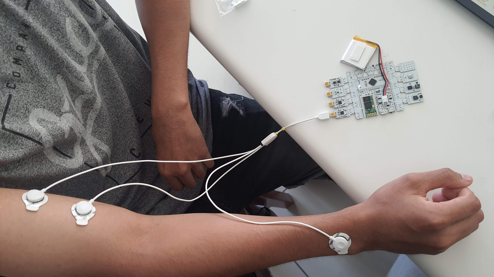
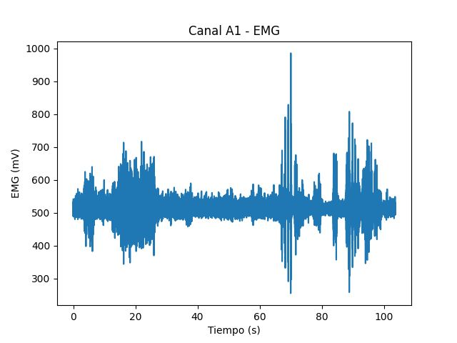

# Grupo 11 - Introduccion a Señales Biomedicas
Bienvenidos al repositorio del grupo 11 del curso "Introduccion a Señales Biomedicas"

## Nombre del Proyecto

Breve descripción del proyecto.

### Tabla de contenidos

- [Integrantes](#Integrantes)
- [Materiales](#Materiales)
- [Documentacion](#Documentacion)

### Integrantes:

El equipo de trabajo está conformado por los siguientes estudiantes:

* Erika Paola Uchuya Trocones (colaborador) - erika.uchuya@upch.pe
* Hector Dair Alegria Cortez (colaborador) - hector.alegria@upch.pe
* Jorge Eduardo Medina Celiz (colaborador) - jorge.medina@upch.pe
* Fernando Eduardo Puipulivia Zarate (colaborador) - fernando.puipulivia@upch.pe
* Felix Renato Rojas Arellanos (colaborador) - felix.rojas@upch.pe

### Materiales

Lista de materiales necesarios para la adquisición de las señales y el procesamiento inicial de tales datos.

1)  Arduino nano 33 IoT
  

  
2) Arduino TinyML kit

  
3)  Ultracortex EEG headset
  

4)  Fluke ProSim 4
  

5)  BiTalino
  

### Documentacion

Se resumen en esta sección los avances semanales del proyecto.
  
Entregable 3
  1. Fotos de las conexiones usadas
  
    1.1 Conexiones BITalino-cables
  

    1.2 Conexiones electrodos-cuerpo
  

  2.Video de señal en silencio eléctrico o reposo

    2.1 Video 1
 

    2.2 Video 2
 

  3. Imagen del EMG obtenido en Python 
 

 

